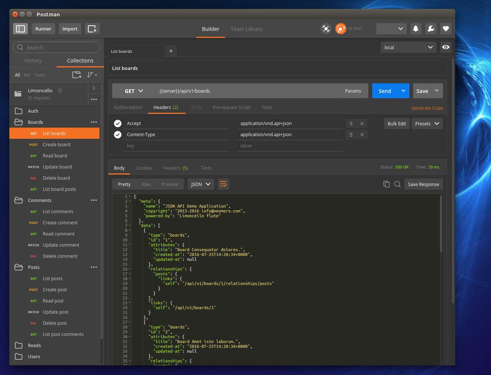

## Quick start JSON API application

Limoncello Flute is a [JSON API](http://jsonapi.org/) quick start application.
 
This application integrated with
- [JSON API implementation](https://github.com/neomerx/json-api)
- [Cross-Origin Resource Sharing](https://github.com/neomerx/cors-psr7) (CORS)

Based on
- [Zend Diactoros](https://github.com/zendframework/zend-diactoros)
- [Doctrine](http://www.doctrine-project.org/)
- [Pimple](http://pimple.sensiolabs.org/)
- [Monolog](https://github.com/Seldaek/monolog)
- [FastRoute](https://github.com/nikic/FastRoute)
- Built with :heart: [Limoncello](https://github.com/limoncello-php/app)

It could be a great start if you are planning to develop JSON API.

The application includes
- CRUD operations for a few sample resources with input data validation.
- Support for such JSON API [features](http://jsonapi.org/format/#fetching) as resource inclusion, sparse field sets, sorting, filtering and pagination.
- JSON API errors.
- API tests.

Supported features
- Multiple nested paths resource inclusion (e.g. `posts,posts.user,posts.comments.user`).
- Sorting by multiple attributes.
- Filters could be applied to attributes and primaries in relationships (all major relationship types such as `belongsTo`, `hasMany` and `belongsToMany`). Supported operators `=`, `eq`, `equals`, `!=`, `neq`, `not-equals`, `<`, `lt`, `less-than`, `<=`, `lte`, `less-or-equals`, `>`, `gt`, `greater-than`, `>=`, `gte`, `greater-or-equals`, `like`, `not-like`, `in`, `not-in`, `is-null`, `not-null`.
- Pagination works for main resources and resources in relationships. Limits for maximum number of resources are configurable.

### Installation

Install [docker-compose](https://docs.docker.com/compose/)

Clone the project

Start local web server at [http://localhost:8080](http://localhost:8080) with

```bash
$ composer install && composer stage-up
```

> Note: use `$ composer stage-down` to stop the servers.

[](https://app.getpostman.com/run-collection/064046759f3d14d4def7#?env%5Blocal%5D=W3sia2V5Ijoic2VydmVyIiwidmFsdWUiOiJodHRwOi8vbG9jYWxob3N0Ojg4ODgvIiwidHlwZSI6InRleHQiLCJuYW1lIjoic2VydmVyIiwiZW5hYmxlZCI6dHJ1ZX0seyJrZXkiOiJ0b2tlbiIsInR5cGUiOiJ0ZXh0IiwidmFsdWUiOiJmTHZRelFKaXRuSElYUUl0MiIsImVuYWJsZWQiOnRydWV9XQ==)

The application comes with [Postman](https://www.getpostman.com/) collection of various CRUD operations you can do with the server (link above).

That is a screen-shot of how it might look.



### Local Development

When developed locally some of the command might be useful (for full list see `composer.json`)

Reset and migrate database schema with data seeding

```bash
$ composer db
```

individual commands are

```bash
$ composer db-reset && composer db-migrate && composer db-seed
```

local development environment (MySQL server only) could be set up / shut down with

```bash
$ composer local-up
```

and

```bash
$ composer local-down
```

application could be switched to `production` mode and back to `development` with

```bash
$ composer build
```

and

```bash
$ composer develop
```

### License

[MIT license](http://opensource.org/licenses/MIT)
