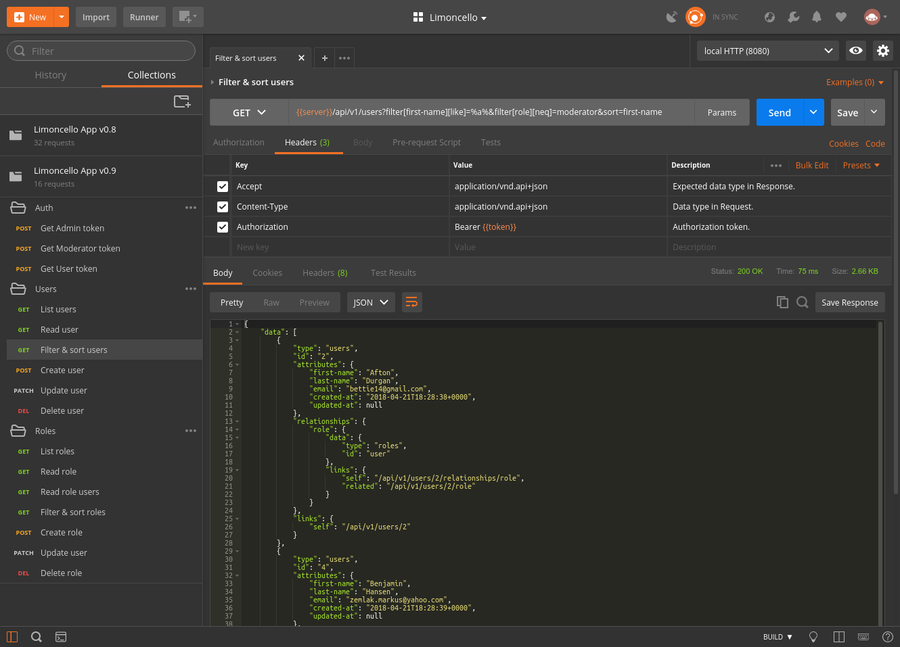

[](https://packagist.org/packages/limoncello-php/app)

### Summary

[](http://www.youtube.com/watch?v=UsIW5jC7rSc)

Limoncello App is a fully featured OAuth 2.0 [JSON API](http://jsonapi.org/) quick start application.

Out-of-the-box it has

- [JSON API](http://jsonapi.org/) CRUD operations (create, read, update and delete) for a few sample resources with `to-one`, `to-many` and `many-to-many` relationship types.
- Support for such JSON API [features](http://jsonapi.org/format/#fetching) as resource inclusion, sparse field sets, sorting, filtering and pagination.
- Database migrations and seedings.
- OAuth 2.0 server authentication and role authorization.
- Admin panel for managing users and roles.
- Cross-Origin Resource Sharing (CORS).
- JSON API errors.
- API tests.
- Web tests.

Supported features
- Multiple nested paths resource inclusion (e.g. `posts,posts.user,posts.comments.user`).
- Filtering and sorting by multiple attributes in resources and its relationships.
- Supported operators `=`, `eq`, `equals`, `!=`, `neq`, `not-equals`, `<`, `lt`, `less-than`, `<=`, `lte`, `less-or-equals`, `>`, `gt`, `greater-than`, `>=`, `gte`, `greater-or-equals`, `like`, `not-like`, `in`, `not-in`, `is-null`, `not-null`.
- Pagination works for main resources and resources in relationships. Limits for maximum number of resources are configurable.

Based on
- [Zend Diactoros](https://github.com/zendframework/zend-diactoros)
- [Doctrine](http://www.doctrine-project.org/)
- [Pimple](http://pimple.sensiolabs.org/)
- [Monolog](https://github.com/Seldaek/monolog)
- [FastRoute](https://github.com/nikic/FastRoute)
- [Twig](https://twig.sensiolabs.org/)
- [JSON API implementation](https://github.com/neomerx/json-api)
- [Cross-Origin Resource Sharing](https://github.com/neomerx/cors-psr7)
- Built with :heart: [Limoncello](https://github.com/limoncello-php/framework)

It could be a great start if you are planning to develop JSON API.

Feel free to ask questions and thank you for supporting the project with :star:.

### Installation

#### 1 Create project

```bash
$ composer create-project --prefer-dist limoncello-php/app app_name
$ cd app_name
```

Recommended additional step
```bash
$ npm install
```
or
```bash
$ yarn install
```

#### 2 Run server

Application runs PHP built-in server on port 8080

```bash
$ composer serve
```

Recommended
```bash
$ npm serve
```
or
```bash
$ yarn serve
```

> Port could be configured in `composer.json` or `client/webpack/base.config.js`

If you use `Postman` here is a collection of API requests that would work with a local server (reading users, filter users, create users, and etc).

[](https://app.getpostman.com/run-collection/a911c4ba41085dea3816)

Here is a `Postman` screen-shot with the collection opened 



#### 3 Turn on production mode (optional)

**By default** the application is installed in **development mode** (less performance, tests and development libraries are available). Application could be switched into **production mode** (higher performance, no tests, no development libraries) with command

```bash
$ composer build
```

Performance comparision with other frameworks could be found [here](https://github.com/limoncello-php/framework/tree/master/docs/bench/minimalistic) and [here](https://github.com/limoncello-php/framework/tree/master/docs/bench/realistic).

### Testing

```bash
$ composer test
```

### License

[MIT license](http://opensource.org/licenses/MIT)
